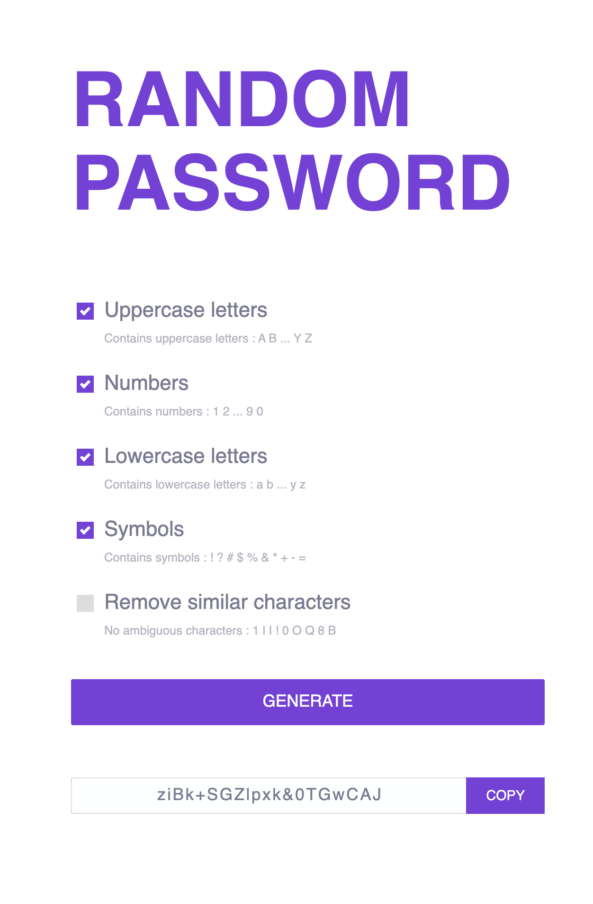

# Random Password

This is a simple web-based password generator that allows users to generate random passwords with customizable options. You can select which types of characters to include (uppercase, lowercase, numbers, symbols) and whether to exclude similar characters to enhance security.

## Features

- **Character Types**: Include or exclude uppercase letters, lowercase letters, numbers, and symbols.
- **Exclude Similar Characters**: Option to remove characters that may look similar to prevent confusion.
- **Password Length**: Generates a password with a fixed length of 20 characters.
- **Copy to Clipboard**: Easily copy the generated password with a click.

## Demo



## Getting Started

1. **Clone the Repository**:
   ```bash
   git clone https://github.com/thoria-subahi/random-password.git
   ```